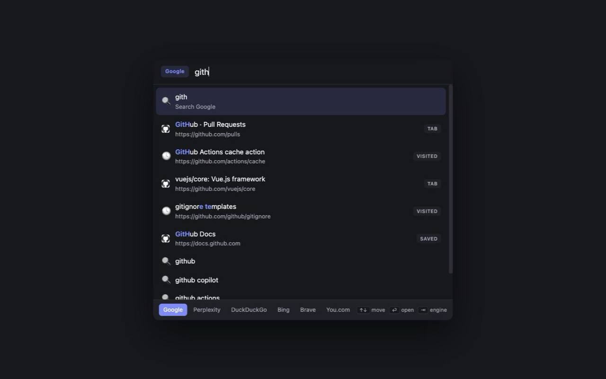

# Quick Search

A keyboard launcher for Chrome. One shortcut to reach any open tab, any page you have visited, any
bookmark — or search the web across six engines without touching the mouse.

Built with Vue 3, Vite and Manifest V3.



## What it does

- **One window, every source** — open tabs, browsing history, bookmarks, web suggestions and browser
  commands, ranked together
- **Opens centered** — a floating window in the upper third of your focused window, not a panel pinned
  to the toolbar corner, and it works on `chrome://` pages and the Web Store
- **Instant local results** — tabs, history and bookmarks render on every keystroke; web suggestions
  merge in when they arrive, without moving your selection
- **Frecency ranking** — matches are weighted by how recently and how often you visited, not just by
  text similarity, and duplicates across sources collapse into one row
- **Filters and site shortcuts** — `t` tabs, `h` history, `b` bookmarks, `>` commands, `yt` YouTube,
  `gh` GitHub, `npm`, `mdn`, `w`, `so`
- **Six engines, one keystroke** — <kbd>Tab</kbd> cycles Google, Perplexity, DuckDuckGo, Bing, Brave
  and You.com
- **Light, dark or system** — one click in the launcher footer, or `>` then "Switch theme"
- **Address bar too** — type `qs` then your search to skip the window entirely
- **Nothing leaves your device** except the query you type, and only when web suggestions are on

## Shortcut

| Platform | Shortcut |
| --- | --- |
| Windows / Linux | <kbd>Ctrl</kbd> + <kbd>Shift</kbd> + <kbd>Space</kbd> |
| macOS | <kbd>Command</kbd> + <kbd>Shift</kbd> + <kbd>Space</kbd> |

Chrome can only suggest a shortcut, so it may arrive unassigned if another extension holds that
combination. The welcome page shows the shortcut you actually have and links to
`chrome://extensions/shortcuts`.

Full key reference: [KEYBOARD_SHORTCUTS.md](KEYBOARD_SHORTCUTS.md).

## Install

### From source

```bash
pnpm install
pnpm build:chrome
```

Then open `chrome://extensions/`, enable **Developer mode**, click **Load unpacked** and select
`dist/chrome`.

### Development

```bash
pnpm dev:chrome     # hot reload
pnpm build          # chrome + firefox production zips
pnpm typecheck
pnpm lint
./build-and-test.sh # clean production build with load instructions
```

## Permissions

| Permission | Why |
| --- | --- |
| `storage` | Settings and recent searches, stored locally |
| `tabs` | Match and focus your open tabs |
| `windows` | Open the launcher window centered, and focus the right window when you pick a tab |
| `history` | Match pages you have visited |
| `bookmarks` | Match bookmarks, and save the current tab from the bookmark action |
| `favicon` | Site icons from Chrome's local cache — no requests to a favicon service |
| `host: suggestqueries.google.com` | Web autocomplete, disableable in Settings |

There is **no** `<all_urls>` permission and no content script: Quick Search never reads or changes the
pages you visit. See [PRIVACY_POLICY.md](PRIVACY_POLICY.md).

## Architecture

```
src/
├── background/       Service worker: launcher window, suggest proxy, omnibox
│   ├── index.ts
│   └── launcherWindow.ts   create / reuse / center / close-on-blur
├── lib/              Browser-agnostic core
│   ├── engines.ts    Single engine + bang registry
│   ├── score.ts      Fuzzy matching, frecency, dedupe, ranking
│   ├── parseQuery.ts Prefix and bang parsing
│   ├── execute.ts    Opening results and running commands
│   ├── settings.ts   Settings load/save + theme
│   ├── recent.ts     Recent searches
│   └── sources/      tabs · history · bookmarks · commands · suggest
└── ui/
    ├── launcher/     The launcher window (bare Vue, no router/UI kit)
    ├── options/      Settings page
    ├── welcome/      Post-install onboarding
    └── shared/       Shared page styles
```

Adding a source means writing one file in `lib/sources/` that implements `Source` and listing it in
`useLauncher.ts`. Adding an engine or a site shortcut is one line in `lib/engines.ts`.

## Browser support

Chrome 104+ and Chromium browsers (Edge, Brave, Arc, Vivaldi). A Firefox build is produced by
`pnpm build:firefox`; the `favicon` permission is Chrome-only and is filtered out there, so Firefox
falls back to glyph icons.

## License

MIT
